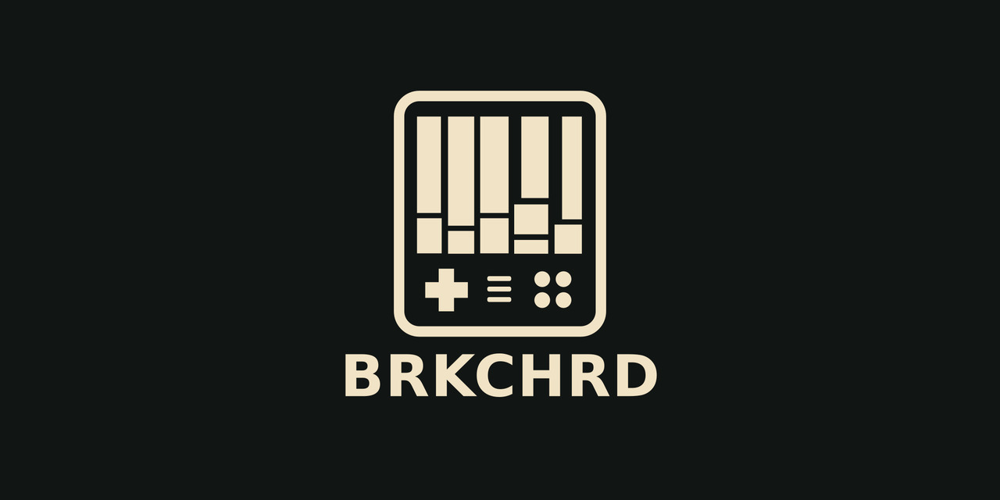

<p align="center">
  
</p>

# BRKCHRD

<p align="center">
  <strong>A playable harmony instrument for TrimUI Brick.</strong><br>
  Functional chords, instrument-aware voicings, sixteen synthesis presets and live performance controls without a laptop.
</p>

<p align="center">
  
  
  
  
</p>

**English:** [Manual](docs/manual.en.md) · [Controls](docs/controls.en.md) · [Sound design](docs/sound-design.en.md) · [Installation](docs/install.en.md) · [NextUI](docs/install.nextui.en.md) · [Architecture](docs/architecture.en.md) · [Development](docs/development.en.md) · [Troubleshooting](docs/troubleshooting.en.md) · [Licensing](docs/licensing.en.md)

**Русский:** [Руководство](docs/manual.ru.md) · [Управление](docs/controls.ru.md) · [Звуковой движок](docs/sound-design.ru.md) · [Установка](docs/install.ru.md) · [NextUI](docs/install.nextui.ru.md) · [Архитектура](docs/architecture.ru.md) · [Разработка](docs/development.ru.md) · [Диагностика](docs/troubleshooting.ru.md) · [Лицензирование](docs/licensing.ru.md)

---

## English

BRKCHRD turns the four face buttons into a coherent chord instrument. The default bank provides the central progression functions; R1 and R2 temporarily expose alternative banks. The D-pad can store a harmonic colour, apply one only while held, edit the sound or perform momentary effects.

### Highlights

- **Playable harmony rather than a chord encyclopedia.** Banks are arranged for performance and songwriting.
- **English or Russian interface.** `LANGUAGE / ЯЗЫК = EN / RU` changes the complete interface immediately. Russian uses native Cyrillic glyphs in the built-in bitmap font.
- **Two chord-colour workflows.** `CHORD DPAD = TOGGLE` stores a colour; `HOLD` applies it only while the direction is held and returns to BASE on release. The active colour is shown in the CHORD panel without covering the interface with a popup.
- **Five interface palettes.** `UI PALETTE` switches AMETHYST, LOGO, OCEAN, EMBER and MONO immediately; the selected palette also colours the startup logo.
- **Deterministic or expressive voicing.** Voice Lead Off is repeatable; Voice Lead On selects nearby route-sensitive inversions without ignoring the chosen octave.
- **Instrument-aware orchestration.** Pads can use wide voicings while bass and heavy presets avoid dense low extensions.
- **Sixteen factory sounds.** Keys, pads, organ, strings, choir, plucks, reeds, glass, heavy and sub-oriented patches use distinct synthesis paths.
- **PortMaster and NextUI packages.** Both include branding, RU/EN documentation, GPL and attribution notices.

### Main controls

| Control | Action |
| --- | --- |
| Front illuminated left/right | Octave down/up |
| L1 press | Cycle `CHORD → SOUND → PERF FX` |
| L2 hold | Alternate colour, sound or PERF FX layer |
| R1 / R2 hold | Temporary alternate chord banks |
| D-pad | Chord colour, sound editing or momentary FX |
| ABXY | Play the active functional chord set |
| Select | Settings |
| Start tap | PAD / STRUM / ARP / PULSE |
| Start hold | All notes off |
| Start + Select | Save and exit |

### Build

```bash
cmake -S . -B build -DCMAKE_BUILD_TYPE=Release
cmake --build build -j2
ctest --test-dir build --output-on-failure
./build/brkchrd-sdl
```

---

## Русский

BRKCHRD превращает четыре лицевые кнопки в цельный гармонический инструмент. Основной банк содержит центральные функции тональности, R1 и R2 временно открывают дополнительные банки. Крестовина может сохранить окраску, применять её только при удержании, редактировать звук или управлять моментальными эффектами.

### Основные возможности

- **Инструмент для игры, а не справочник аккордов.** Банки организованы вокруг музыкальных функций и удобных переходов.
- **Английский или русский интерфейс.** `LANGUAGE / ЯЗЫК = EN / RU` переключает весь интерфейс сразу. Кириллица встроена в пиксельный шрифт.
- **Два способа работы с окраской.** `DPAD АККОРД = НАЖАТИЕ` сохраняет её; `УДЕРЖ.` применяет только во время удержания и возвращает ОСНОВУ после отпускания. Активная окраска видна в панели АККОРД без перекрывающего интерфейс окна.
- **Пять палитр интерфейса.** `ПАЛИТРА UI` сразу переключает АМЕТИСТ, ЛОГО, ОКЕАН, УГЛИ и МОНО; выбранная палитра используется и для логотипа при запуске.
- **Стабильное или живое голосоведение.** При выключенном ведении результат повторяем, при включённом выбираются ближайшие инверсии с сохранением смысла выбранной октавы.
- **Раскладка зависит от тембра.** Пэды получают широкие аккорды, а басовые и тяжёлые пресеты не забиваются плотными низкими расширениями.
- **Шестнадцать заводских звуков.** Клавишные, пэды, орган, струнные, хор, щипковые, язычковые, стеклянные, тяжёлые и сабовые тембры используют разные методы синтеза.
- **Пакеты PortMaster и NextUI.** В оба входят оформление, документация RU/EN, GPL и уведомление об исходном проекте.

### Главное управление

| Кнопка | Действие |
| --- | --- |
| Передние светящиеся слева/справа | Октава вниз/вверх |
| L1 нажатием | `АККОРД → ЗВУК → ПЕРФ FX` |
| L2 удержанием | Альтернативный слой текущего режима |
| R1 / R2 удержанием | Временные банки аккордов |
| Крестовина | Окраска, редактирование звука или моментальные FX |
| ABXY | Игра аккордов активного банка |
| Select | Настройки |
| Start коротко | ПЭД / БОЙ / АРП / ПУЛЬС |
| Start долго | Снять все ноты |
| Start + Select | Сохранить и выйти |

## License / Лицензия

BRKCHRD is licensed under **GNU GPL-3.0-or-later**. Modified distributions must preserve the origin notice from [`NOTICE.md`](NOTICE.md):

> Based on BRKCHRD by Myldy design — https://github.com/myldy20/BRKCHRD

BRKCHRD распространяется по лицензии **GNU GPL-3.0-or-later**. При распространении модифицированной версии необходимо сохранить уведомление об исходном проекте. Форки должны использовать отличимое оформление и не выдавать себя за официальный релиз BRKCHRD.

Developed by **Myldy design** — [@myldy20](https://github.com/myldy20).
